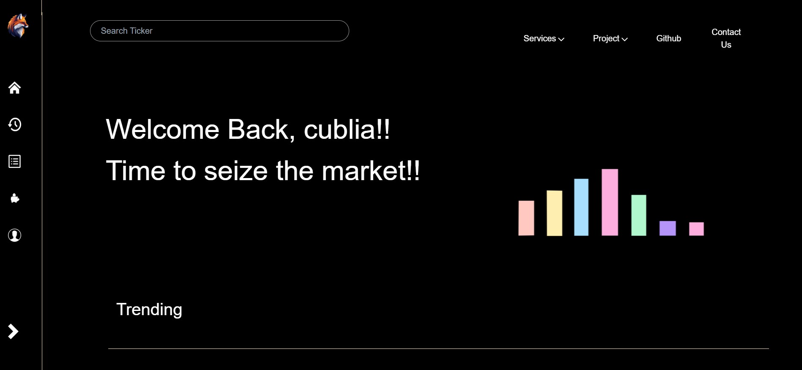
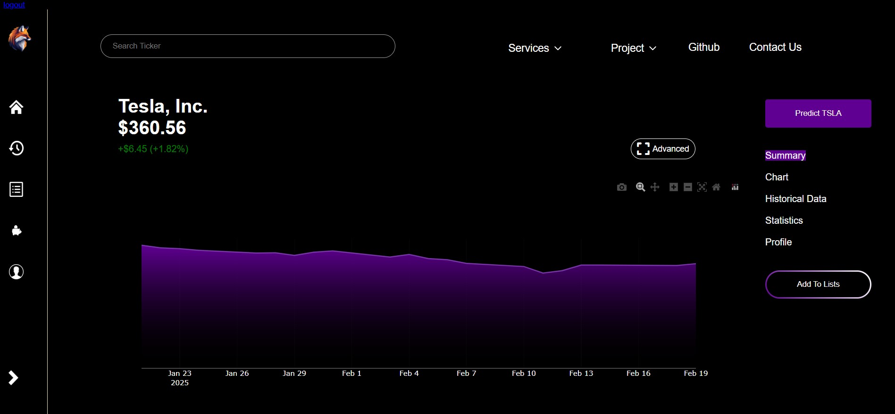
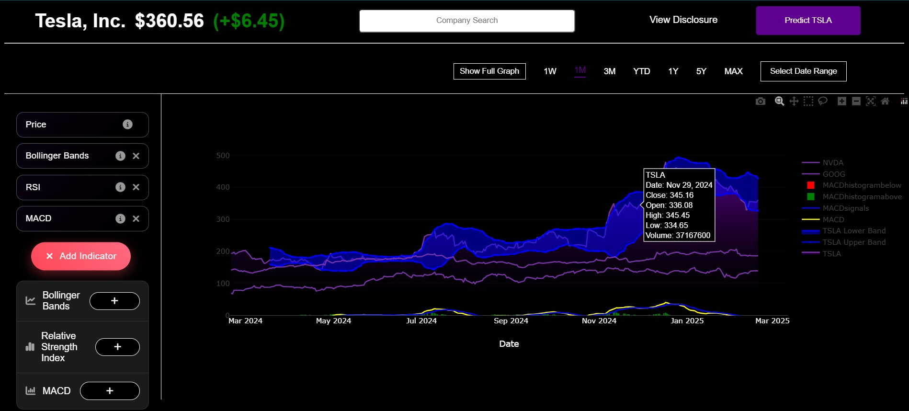
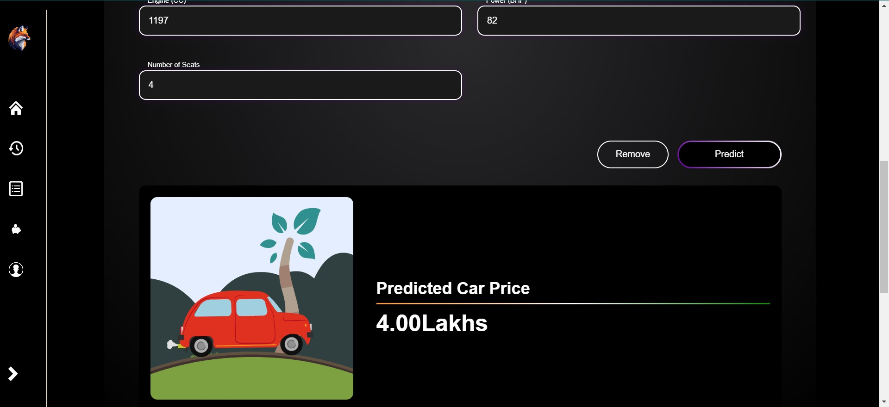

<p align="center">
    
    <h2 align="center">FoxTrend</h2>
    <p align="center">Your Ultimate Stock Analysis & Prediction Platform</p>
</p>
<p align="center">
    <a href="https://github.com/XBastille/FoxTrend/issues">
        
    </a>
    <a href="https://github.com/XBastille/FoxTrend/pulls">
        
    </a>
    <a href="https://github.com/XBastille/FoxTrend/stargazers">
        
    </a>
    <a href="https://github.com/XBastille/FoxTrend/graphs/contributors">
        
    </a>
    <br />
    <br />
</p>

# 🎉 NOW LIVE AND FULLY RELEASED! 🚀
FoxTrend is now fully operational and accessible to everyone!

## 🌐 Live Deployments
- Render: [https://foxtrend.onrender.com](https://foxtrend.onrender.com) (takes 1-2 minutes to load)

## 📸 Project Showcase

### Screenshots

<p align="center">
    
</p>

<p align="center">
    
</p>

<p align="center">
    
</p>

<p align="center">
    
</p>

<p align="center">
    
</p>

### Video
[video demo]

## 🎯 What is FoxTrend?
FoxTrend is a comprehensive platform designed to provide detailed stock price information, predictions, and company insights for every company in existence, including cryptocurrencies. With an emphasis on data-driven decision-making, our platform enables users to track stock prices and forecast future trends with accuracy and ease. 📊💡

## Love FoxTrend? Give us a ⭐ to show your support

## Features

- 📈 **Stock Price Display**: Access stock prices and information for all companies, including cryptocurrencies.
- 🤖 **Stock Price Prediction**: Utilize advanced machine learning models to predict future stock prices.
- 🏢 **Company Information**: Retrieve detailed company information alongside stock prices and predictions.
- 📊 **Interactive Charts**: Visual representation of stock trends and predictions

### 🛠 Additional Tools
- 🚗 **Used Car Price Prediction**: Smart market value estimation for vehicles
- 💳 **Loan Approval Prediction**: Intelligent loan approval probability assessment
- 🏠 **Housing Price Prediction**: Data-driven property price forecasting

## 👥 Meet the Team

Special thanks to our amazing collaborators who helped make FoxTrend possible:

- [Abhinab Sharma](https://github.com/Abhinab04) - FullStack Developer
- [Subha Archita](https://github.com/SubhaArchita) - FullStack Developer
- [Ayush Kumar Jha](https://github.com/Ayush10761op) - FullStack Developer

Their dedication and expertise were instrumental in bringing FoxTrend to life! 🌟


## Getting Started

Clone the repository to explore the initial codebase:

```bash
git clone https://github.com/XBastille/FoxTrend.git
```

After cloning, initialize the project by running the following commands:

```bash
cd FoxTrend
npm init
npm i bcryptjs body-parser express express-session hbs passport passport-local node-cron csv-parser mongoose aws-sdk winston cluster
pip install -r requirements.txt
```

Ensure you configure the project with your own SQL password and MongoDB URL by updating the respective configuration files. Add your MongoDB key in `key.js` and your SQL password in the relevant Java files.

## 💻 Tech Stack
- Frontend: HTML, CSS, JavaScript
- Backend: Node.js, Express
- Database: MongoDB, SQL
- Cloud: AWS Elastic Beanstalk, Render
- ML models & Data scraping: Python

## 📱 Platform Compatibility
- 💻 Desktop/Laptop

## 📞 Contact & Support
- 📧 Email: [eziopuhan825@gmail.com](mailto:eziopuhan825@gmail.com)
- 💬 Issues: GitHub [Issues](https://github.com/XBastille/FoxTrend/issues)

## ☕ Support & Donate

If you find FoxTrend helpful, consider buying me a coffee! It would motivate us to make more amazing projects in the future.

<a href="https://buymeacoffee.com/xbastille" target="_blank"></a>


Thank you for your interest in FoxTrend! 🙏🚀

---

